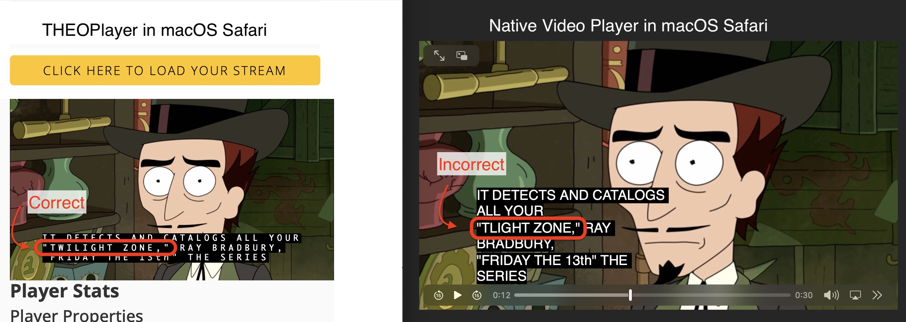
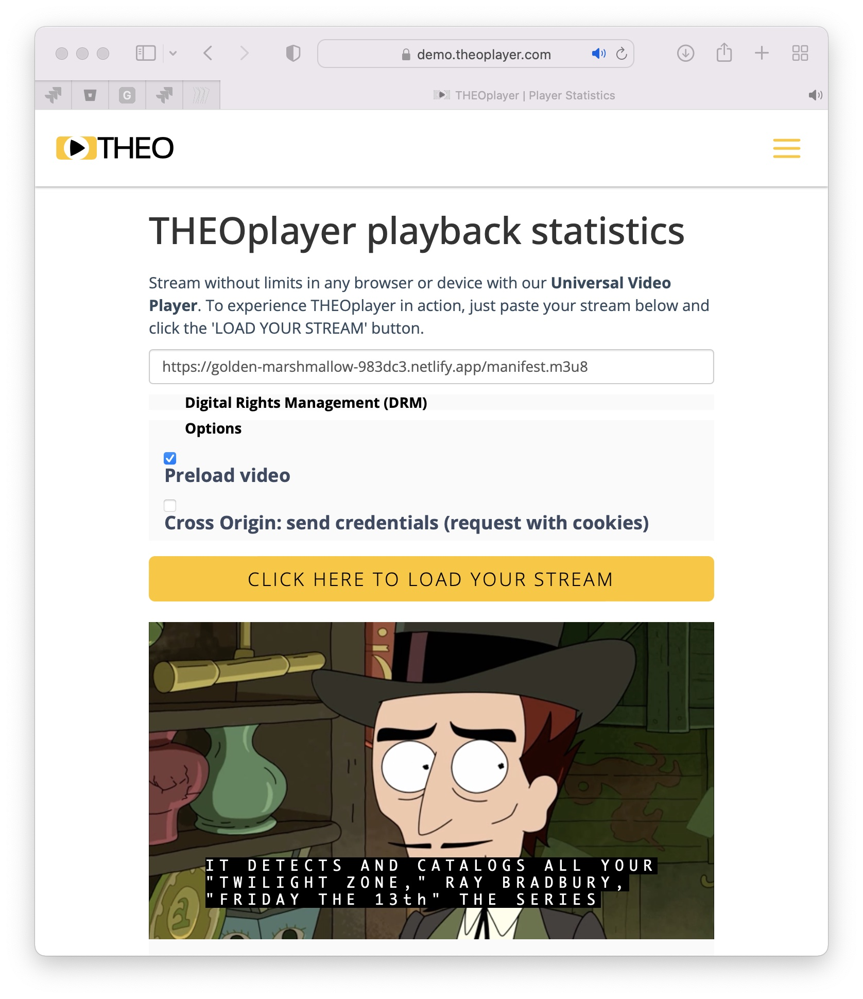

# CEA-708 bug

Subtitles are scrambled using the native video player in Safari on macOS an iOS. But when rendering the same subtitles using THEOplayer in the browser they render correctly:

## Reproduction

- Open **Safari Version 15.3** (17612.4.9.1.8) on **macOS 12.2.1** (21D62)
- Visit: https://golden-marshmallow-983dc3.netlify.app/manifest.m3u8
- Enable the closed captions
- Play the video

### Expected result

The subtitles at the timecode `0:12` should be:

> It detects and catalogs all your "**twilight** zone" Ray Bradbury, the series

### Actual result

The subtitles at the timecode `0:12` are:

> It detects and catalogs all your "**tlight** zone" Ray Bradbury, the series

## HLS Stream details

The HLS stream can be accessed at https://golden-marshmallow-983dc3.netlify.app. If however, this link goes down you can easily host the stream yourself by hosting the files that are in the `stream/` directory.

## Reference player that renders correctly

You can also render subtitles of the same video using THEOplayer to check the correct/expected results. To do this:

- Go to https://demo.theoplayer.com/test-your-stream-with-statistics
- Enter the following URL in the text input field: https://golden-marshmallow-983dc3.netlify.app/manifest.m3u8
- Press the yellow button labeled: *Click here to load your stream*
- Press play on the video
- Enable the closed captions by clicking on the subtitles icon underneath the progress bar and toggling on the CC1 option.

